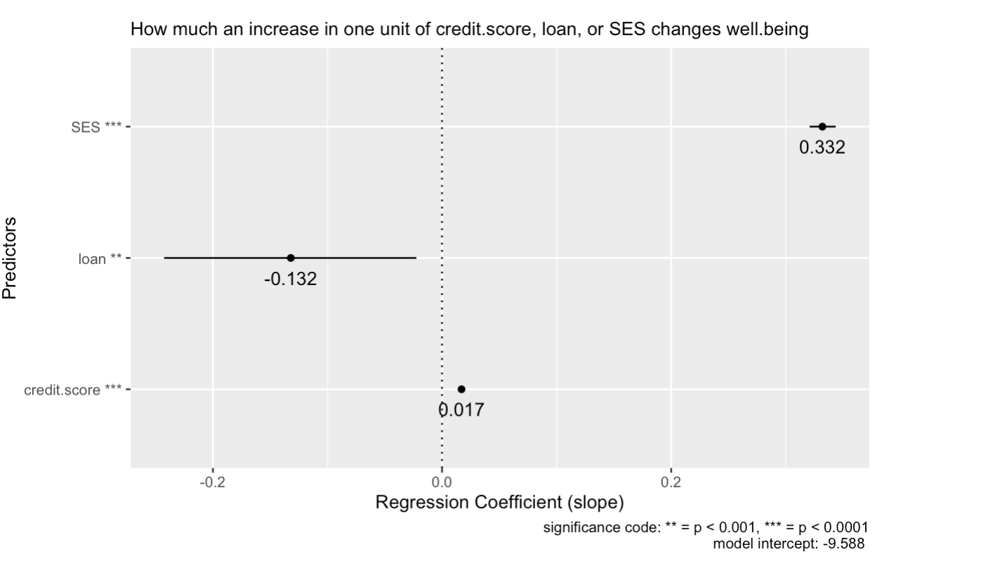
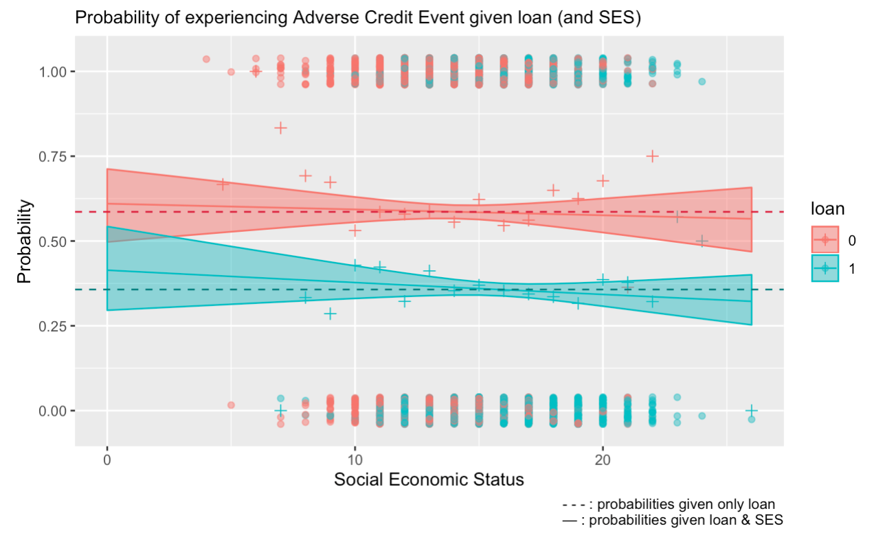

A financial conduct regulator needs to investigate the effect of payday loans. A dataset of a survey from 5,000 customers where they reported their well-being and a measure of their socio-economic status linked to their credit file is available.

Two questions arose: \n
1. Does receiving a payday loan change well-being? If so, how much? \n
2. Does taking payday loan makes people more or less likely to experience an adverse credit event?

```{r setup, message=FALSE}
rm(list=ls())
library(tidyverse)
library(DataExplorer)
library(emmeans)
library(gridExtra) # for grid.arrange()
library(gmodels)
library(MASS)
options(width=100)
```

```{r dataprep, message=FALSE}
# --------- import data
payday <- read.csv('payday.csv')

# --------- variable check
payday$credit.score <- as.numeric(payday$credit.score)
payday$SES <- as.numeric(payday$SES)
payday$well.being <- as.numeric(payday$well.being)
#payday$adverse.credit.event <- factor(payday$adverse.credit.event, levels = c(0,1), labels = c("no adverse", "adverse"))
payday$id <- NULL

view(payday)
str(payday)
plot_missing(payday) 
```

# Data Dictionary

Variable                  | Description                                                                 
--------                  | ---------------------------------------------------------------------------------------
id                        | Customer ID 
credit.score              | Customer's credit score [400 to 600]
SES                       | People's socio-economic status, with higher scores indicating higer status [1 to 26]
loan                      | A dummy variable indicating whether or not people were given the payday loan [0: no or 1: yes]
well.being                | Customer's self-reported well-being on a 1-7 scale, with 7 being the highest well-being [1 to 7]
adverse.credit.event      | A dummy indicating whether there was an adverse credit event in the next year [0: no or 1: yes]

---

# Does receiving a payday loan change well-being? If so, how much? 

> Yes, loan significantly affects well-being by a decrease of .132 in well-being score if one receives payday loan, 95% CI[(-.242) – (-.022)], and no decrease otherwise, given SES and credit score held constant.

Individually, loan, SES, and credit score have significant effect and a positive correlation when used as a predictor of well-being. Put it simply, as one increases, well-being increases too. However, well-being is best explained by using the combination of loan, credit.score, and SES as predictors using a multiple regression model, $R^2$ = .694. Figure 1 describes how each predictor changes well-being when used together.

 

Figure 1. Regression coefficient of credit score, loan, and SES to describe the change in well-being per each unit increase.

Relative to other predictors, although still significant, loan has the least significant effect towards well-being, $F(1,4996)=7.456$, $p = .006$. This is expected since loan and credit.score are highly correlated, $R^2$ = .494, whilst credit score can explain well-being better than loan, $R^2$ = .494 and $R^2$ = .354 respectively. Thus, making the model shifts its attention more to credit score than loan when it comes to predicting well-being.

As for the magnitude of change, holding credit.score and SES constant, one unit increase on loan variable predicts a decrease of .132 unit of well-being 95% CI[(-.242) – (-.022)]. Such change is significant, $t(4996) = -2.359$, $p < .001$.

---

# Does taking payday loan makes people more or less likely to experience an adverse credit event?

> Those taking payday loan are less likely to experience adverse credit event. And Social Economic Status does not have a significant effect on adverse credit event nor on the relationship loan has with adverse credit event.

 
Figure 2. A comparison of probability estimate on adverse credit event given loan (and SES)

Figure 2 describes the difference in probability of experiencing adverse credit event (ACE) when receiving a loan and a comparison of how insignificant SES affect the probabilities as SES increases. The dashed line is the probability estimate for ACE given a loan or not (without SES), the dots describes the individuals who either experienced ACE or not, the +s are the proportion of ACE in each SES rank, while the line and ribbon are the fit of a logistic regression model and its 95% CI given SES.

The effects of loan on ACE is significant, $\chi^2(4998)$=6644.6, $p$<.0001. In contrast, SES has almost no effect on ACE,  $\chi^2$(4997)=6643.7, $p$=.339 nor on the relationship loan has with ACE, $\chi^2(4996)$=6643.6, $p$=.339.

The probability of those taking payday loan to experience ACE, .357 95% CI[.339 – .376], is lower than those who do not, .586 95% CI[.566 – .606], about an absolute .229 change in probability.

---

# In-depth Analysis

```{r question-1: EDA}
# --------- Exploratory Data Analysis

summary(payday)
plot_histogram(payday)
pairs(payday, panel=panel.smooth)
plot_correlation(payday)

grid.arrange(
	ggplot(payday, aes(y=well.being, x=credit.score,colour=as.factor(payday$loan))) + geom_point(mapping = aes(colour=as.factor(payday$loan))) + scale_y_continuous(breaks = 1:7) +labs(x="Credit score", y="Well-being",title="Relationship between credit.score and well.being by loan",col="Loan") + geom_smooth(method=lm),
	
	ggplot(payday, aes(y=well.being, x=SES,colour=as.factor(payday$loan))) + geom_jitter() +scale_y_continuous(breaks = 1:7)+ labs(x="Social Economic Status", y="Well-being",title="Relationship between SES and well.being by loan",col="Loan") +geom_smooth(method=lm))
```


```{r question-1: Multicolinarity}
#  --------- Compute R^2 among variables to understand the multicoliniarity.
round((cor(payday))^2, digits = 3)
```
`loan` and `credit.score` has relatively high correlation with each other ($R^2 = .743$), . However, `credit.score` ($R^2 = .494$) can explain well.being better than loan ($R^2 = .354$). Therefore, it is within expectation that `credit.score` might be a more significant independant variable than loan in a multiple regression for well.being.

```{r question-1: Model Fitting, message=FALSE}
# --------- Linear regression on bivariate
LM_loan <- lm(well.being~ loan, data=payday)
LM_credit.score <- lm(well.being~ credit.score, data=payday) 
LM_ses <- lm(well.being~ SES, data=payday) 

# --------- Multiple regression models for well.being
LM_credit.loan <- lm(well.being~ credit.score + loan, data=payday) # model1, without SES 
LM_credit.loan.ses <- lm(well.being ~ credit.score + loan + SES , data=payday)  # model2, including SES
```
`LM_credit.loan` has loan and credit.score as independent variables for well.being. While, `LM_credit.loan.ses` in addition to what `LM_credit.loan` has, SES is added.

```{r question-1: NHST, message=FALSE}
# --------- NHST whether the variables are significant in a bivariate setup
anova(LM_loan) 
anova(LM_credit.score)
anova(LM_ses)

# --------- NHST whether the variance differ between multiple regression model with and without SES
#H0: LM_credit.loan == LM_credit.loan.ses ; HA: LM_credit.loan != LM_credit.loan.ses 
anova(LM_credit.loan, LM_credit.loan.ses) 

# --------- NHST the significance of the variables
# For each variable... H0: model with variable == model without variable ; HA: model with variable != model without variable
anova(LM_credit.loan.ses) 
```
All bivariate LMs has significant effect on `well.being`, but when put together, the significance of loan shifts to `credit.score`. This comes back again to the fact that `credit.score` and `loan` are highly correlated. But `credit.score` still have the upperhand when it comes to predicting `well.being`.

The `LM_credit.loan.ses` fits significantly better, F=3272.5 and p < .0001, with an increase of 0.2 in $R^2$ and a decrease in 3309 of RSS compared to `LM_credit.loan`. We can say that adding `SES` explains an additional 20% of the variance in well being and it is statistically significant. 

All independent variables in `LM_credit.loan.ses` are significant, but compared to `credit.score` and `credit.score`, `loan` is the least significant, p=.006.

```{r question-1: Estimation}
# --------- the equation for wellbeing
summary(LM_credit.loan.ses)
cbind(coef(LM_credit.loan.ses), confint(LM_credit.loan.ses)) #Confidence interval of the estimate
```
`well.being` can be explained through the following equation:
$\widehat{well.being} = -9.588 + 0.017 \times credit.score - 0.132 \times loan + 0.332 \times SES$

As for the magnitude of change, holding `credit.score` and `SES` constant, one unit increase on loan variable predicts a decrease of .132 units on `well.being` 95% CI[(-.242) – (-.022)]. Such change is significant, $t(4996) = -2.359$, $p < .001$.

The negative coefficient of `loan` can be explained by the multiple colinearity with `credit.score`, the binary input, and the constraint of 7 scales of `well.being`. Simply put, `loan` balances `credit.score`'s impact by going to the opposite direction when `loan` == 1.
```{r question-1: mainplot}
# --------- plot prep
df_coeff <- as.data.frame(cbind(coef(LM_credit.loan.ses), confint(LM_credit.loan.ses)))
df_coeff <- mutate(df_coeff, id = rownames(df_coeff))
df_coeff <- anti_join(df_coeff, subset(df_coeff, id=='(Intercept)'))
df_coeff <- df_coeff %>%
  mutate(V1 = round(V1,digits = 3))

df_coeff$id[df_coeff$id == "credit.score"] <- "credit.score ***"
df_coeff$id[df_coeff$id == "loan"] <- "loan **"
df_coeff$id[df_coeff$id == "SES"] <- "SES ***"

# --------- plotting
ggplot(df_coeff , aes(y=as.factor(id), x=V1)) + 
  geom_point() + geom_text(aes(label=V1),hjust=0.5, vjust=2) +
  labs(x="Regression Coefficient (slope)", y="Predictors",subtitle="How much an increase in one unit of credit.score, loan, or SES changes well.being", caption = "significance code: ** = p < 0.001, *** = p < 0.0001\n model intercept: -9.588 " ) + 
  geom_segment(aes(x=`2.5 %`,xend=`97.5 %`,y=as.factor(id),yend=as.factor(id) )) + 
  geom_vline(xintercept = 0, linetype='dotted')
```

---

```{r question-2: EDA}
# --------- Exploratory Data Analysis
mu <- payday %>%
    group_by(adverse.credit.event) %>%
    summarise(mean=mean(credit.score))

ggplot(payday, aes(x=credit.score, color=as.factor(adverse.credit.event), fill=as.factor(adverse.credit.event))) +
  geom_histogram(alpha =0.5, position="dodge", bins = 50)+
  geom_density(alpha=0.6)+
  geom_vline(data=mu, aes(xintercept=mean, color=as.factor(adverse.credit.event)),linetype="dashed")+
  geom_vline(xintercept = 500, colour="#990000", linetype="longdash")+
  scale_color_manual(values=c("#999999", "#E69F00", "#56B4E9"))+
  scale_fill_manual(values=c("#999999", "#E69F00", "#56B4E9"))+
  theme(legend.position="top") 
```

```{r question-2: model fitting, NHST, and Estimation }

# --------- Build logistic regression model 
adverse.by.loan.ses <- glm(adverse.credit.event~loan*SES , family=binomial, data=payday)
adverse.by.loan <- glm(adverse.credit.event~loan, family=binomial, data=payday)

summary(adverse.by.loan.ses)
summary(adverse.by.loan)

# --------- Get the probability of adverse credit event by loan and its estimation
adverse.by.loan.emm <- emmeans(adverse.by.loan, ~loan, type="response")
confint(adverse.by.loan.emm)

# --------- Plot the probabilities
ggplot(summary(adverse.by.loan.emm), aes(x=as.factor(loan), y=prob, ymin=asymp.LCL, ymax=asymp.UCL)) + geom_point() + geom_linerange() + labs(x="Loan", y="Proportion of adverse credit event")  +
  geom_hline(yintercept = 0.586, lty=2) +
  geom_hline(yintercept = 0.357, lty=2)

# --------- Prove that SES is insignificant for explaining adverse.credit.event
anova(adverse.by.loan.ses, test="Chisq")
```
A change of probability of ACE between receiving a loan and not receiving one is about an absolute 22.9%. Additionally, SES has almost no effect on ACE,  $\chi^2$(4997)=6643.7, $p$=.339 nor on the relationship loan has with ACE, $\chi^2(4996)$=6643.6, $p$=.339.

```{r question-2: mainplot}
# --------- Plot Prep
adverse.by.loan.ses.emm <- emmeans(adverse.by.loan.ses, ~loan*SES, at=list(SES=seq(0,26,1)), type="response")
ses.unique<- unique(payday$SES)
payday_t <- payday %>% 
  mutate(SES.deciles=cut(SES, breaks=ses.unique, include.lowest=TRUE))

payday_t.loan.ses <- payday_t %>% 
  group_by(SES.deciles,loan) %>% 
  summarise(Proportion.adverse=mean(adverse.credit.event), decile.mean.ses=mean(SES))

payday_t$loan <- as.factor(payday_t$loan)
payday_t.loan.ses$loan <- as.factor(payday_t.loan.ses$loan)


sum_adverse.by.loan.ses.emm <- as.data.frame(summary(adverse.by.loan.ses.emm))
sum_adverse.by.loan.ses.emm$loan <- as.factor(sum_adverse.by.loan.ses.emm$loan)

# --------- Plotting mainplot
ggplot(sum_adverse.by.loan.ses.emm, aes(x=SES, col=loan, fill=loan,y=prob, ymin=asymp.LCL, ymax=asymp.UCL)) + 
    geom_jitter(data=payday_t, mapping=aes(y=adverse.credit.event, x=SES, col=loan,ymin=NULL, ymax=NULL), height=0.04, width=0, alpha=0.5) + 
    geom_point(data=payday_t.loan.ses, mapping=aes(y=Proportion.adverse, x=decile.mean.ses, col=loan, ymin=NULL, ymax=NULL), size=2, shape=3) +
    geom_ribbon(alpha = 0.5) + 
    geom_line() +
    labs(x="Social Economic Status", y="Probability", caption="- - - : probabilities given only loan  \n  — : probabilities given loan & SES", subtitle = "Probability of experiencing Adverse Credit Event given loan (and SES)" ) + 
  ylim(-0.05,1.05) +
  geom_hline(yintercept = 0.586, lty=2, color='#DC143C') +
  geom_hline(yintercept = 0.357, lty=2, color='#008080')
```